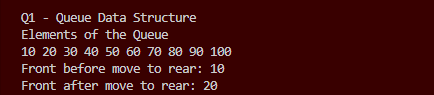
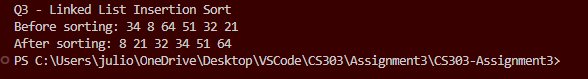

# CS303-Assignment3

## Name
Julio Villarreal

## Design Explanation

For the first question I implemented a generic queue using a singly linked list.
I used a Node class to store the data and a reference to the next node.
The queue consists of:
1. a front pointer for the first element
2. a rear pointer for the last element
3. a size variable to track the number of elements

The queue includes the following methods:
1. offer() add elements to the rear
2. poll() remove the front element
3. peek() view the front element without removing it
4. size() return the number of elements
5. empty() checks if the queue is empty

I implemented the move_to_rear function using queue operations(poll, peek, and offer)

For the second question I implemented a recursive linear search function that finds the last occurrence of a target value.

For the third question I modified insertion sort to work on a singly linked list of ints. 

## How to Run
1. Clone or download this repository
2. Open the project in an IDE such as IntelliJ or VS Code
3. Compile all files
4. Run 'Main.java'

## Examples of functioning methods w screenshots

1. Ex Queue output

2. Ex Recursive Search output

3. Ex Insertion Sort output
